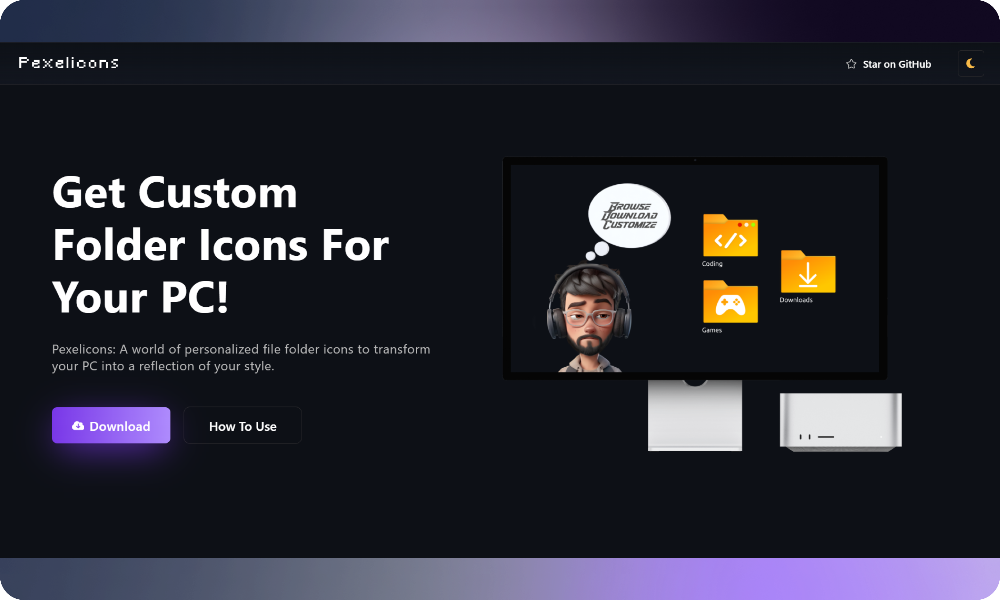

# <a href="https://abel.github.io/Pexelicons" target="_blank">Pexelicons</a>

Pexelicons é um site que oferece ícones de pastas personalizados para Windows, permitindo aos usuários personalizar seu PC alterando os ícones de pasta padrão para corresponder às suas preferências de estilo.

## Características

- 🎨 **Ícones personalizados:** Explore um mundo de ícones de pastas de arquivos personalizados inspirados em vários temas.
- 🚀 **Fácil de usar:** Baixe e aplique ícones personalizados às suas pastas sem esforço.
- 💻 **Compatibilidade:** Os ícones são fornecidos no formato ICO, garantindo compatibilidade com sistemas Windows.

## Índice

- [Primeiros passos](#primeiros passos)
  - [Ícones de download](#download-icons)
  - [Como usar](#como usar)
- [Contribuindo](#contribuindo)
- [Licença](#licença)
- [Contato](#contato)

## Começando

### Baixar ícones

Visite o [site Pexelicons](https://.github.io/Pexelicons) para baixar ícones de pastas personalizados para o seu PC.

### Como usar

Siga estas etapas para aplicar ícones personalizados às suas pastas:

1. **Baixe um ícone personalizado:** Baixe um ícone personalizado (arquivo ICO) que você deseja usar para sua pasta. Os ícones são fornecidos no formato ICO, garantindo compatibilidade com sistemas Windows.
2. **Copie o arquivo ICO para a pasta:** Copie o arquivo ICO personalizado para a pasta cujo ícone você deseja alterar.
3. **Clique com o botão direito na pasta:** Clique com o botão direito na pasta e selecione "Propriedades" no menu de contexto.
4. **Vá para a aba "Personalizar":** Na janela de propriedades da pasta, vá para a aba "Personalizar".
5. **Clique em "Alterar ícone":** Procure o botão "Alterar ícone" e clique nele.
6. **Procure o arquivo ICO personalizado:** Navegue até o local onde você copiou o arquivo ICO personalizado e selecione-o.
7. **Aplicar e OK:** Aplique as alterações e clique em "OK" para fechar a janela de propriedades.

## Contribuindo

Se você quiser contribuir com Pexelicons, sinta-se à vontade para abrir um problema ou enviar uma solicitação pull. Suas contribuições são muito apreciadas!

## Licença

Este projeto está licenciado sob a [Licença MIT](LICENSE).

## Contato

- Para dúvidas, entre em contato com infovinodjangid@gmail.com

---

Projetado e construído por <a href="https://github.com/">@Programador_Shark</a> | &cópia de; @abelsants02
